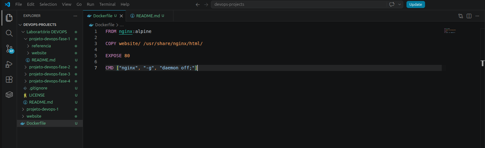
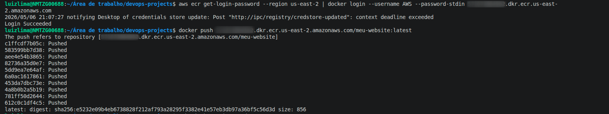
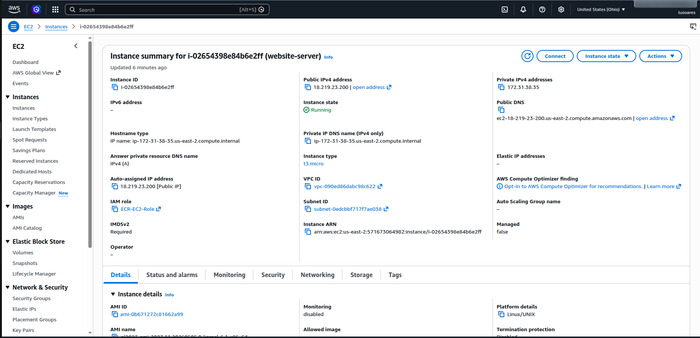
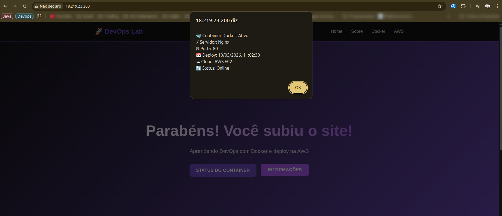

# 🚀 Deploy de Aplicação Containerizada na AWS (EC2 & ECR)  

👨‍💻 **Autor:** Luiz Lima

🎯 **Objetivo:** Demonstração prática de um projeto de infraestrutura com foco DevOps.

💻 **Stack:** AWS (EC2, ECR), Docker, Nginx, Linux (Ubuntu/Amazon Linux).

---
### 📄 Contexto do Projeto

Este projeto simula o ciclo de vida de uma aplicação moderna, migrando de um ambiente de desenvolvimento local para uma infraestrutura robusta em nuvem. O foco principal foi garantir a portabilidade via containers e a segurança da rede através de políticas de acesso refinadas na AWS.Este laboratório faz parte da minha trilha de especialização em Cloud Infrastructure, aplicando conceitos de automação e gerenciamento de imagens.

---

### 🏗️ Arquitetura da Solução

```
┌─────────────────┐     ┌─────────────────┐     ┌─────────────────┐
│  Código Local   │────▶│   Docker Image  │────▶│    Amazon ECR   │
│  (HTML/CSS/JS)  │     │   (Container)   │     │   (Registry)    │
└─────────────────┘     └─────────────────┘     └─────────────────┘
                                                          │
                                                          ▼
                        ┌─────────────────┐     ┌─────────────────┐
                        │    Browser      │◀────│    Amazon EC2   │
                        │  (User Access)  │     │   (Container)   │
                        └─────────────────┘     └─────────────────┘
```
---

### 🛠️ Tecnologias e Ferramentas

**Containerização:** Docker (Criação de Dockerfile e gerenciamento de imagens).

**Registry:** Amazon ECR (Armazenamento privado de imagens).

**Compute:**  Amazon EC2 (Provisionamento de instâncias Linux).

**Web Server:**  Nginx (Servidor de alto desempenho dentro do container).

**Security:**  AWS Security Groups (Regras de Firewall Inbound/Outbound).

---

### 🚀 Implementação Passo a Passo

#### 1. Preparação da Imagem (Docker)
Criei um Dockerfile otimizado utilizando a imagem base nginx:alpine para garantir leveza e segurança.

```dockerfile
# Imagem base - Nginx Alpine (leve e eficiente)
FROM nginx:alpine

# Copia os arquivos do website para o diretório do Nginx
COPY website/ /usr/share/nginx/html/

# Expõe a porta 80 (documentação - não abre a porta realmente)
EXPOSE 80

# Comando padrão quando o container iniciar
CMD ["nginx", "-g", "daemon off;"]
```
###




#### 2. Gestão de Imagens no Amazon ECR
Realizei o push da imagem para o Amazon ECR, permitindo um repositório centralizado e seguro para o deploy na nuvem.

- Autenticação via AWS CLI.
- Tagging de versão (latest).

###




#### 3. Provisionamento e Segurança na AWS
A instância EC2 foi configurada com foco no princípio do menor privilégio:



- IAM Role: Criada para permitir que a EC2 realize o pull da imagem no ECR sem expor chaves de acesso.

- Security Group: Configurado para aceitar tráfego na porta 80 (HTTP) para o público e porta 22 (SSH) restrita para administração.


#### 4. Pull via SSH

Após a configuração da infraestrutura na AWS, o deploy foi realizado via acesso remoto, seguindo o fluxo operacional abaixo:

- Acesso Remoto: Conexão com a instância EC2 via protocolo SSH.
- Runtime: Instalação e configuração do Docker Engine na instância.
- Autenticação: Configuração das credenciais para que o Docker possa interagir com o Amazon ECR.
- Deployment: Pull da imagem Docker armazenada no repositório ECR para o ambiente de execução local.

#### 5. Executar o container

Com a imagem disponível localmente na EC2, o serviço é iniciado utilizando o Docker CLI. O comando abaixo provisiona o container garantindo alta disponibilidade local e exposição da porta padrão:

```bash
docker run -d -p 80:80 --name meu-website-prod --restart always ACCOUNTID.dkr.ecr.us-east-1.amazonaws.com/meu-website:v1.0
```

#### 🎓 Parâmetros importantes:
- **--restart always**: Reinicia o container se a EC2 reiniciar
- **-p 80:80**: Mapeia porta 80 (padrão HTTP)

---

### 🛠️ Notas de Troubleshooting (Visão de Suporte Analítico)
Como Analista de Suporte, foquei em garantir a disponibilidade do serviço através dos seguintes diagnósticos:

- Validação de Conectividade: Identifiquei a necessidade de ajustar as regras de Inbound no Security Group para liberar o acesso externo via IP público.

- Gerenciamento de Portas: Utilizei comandos como ss -tulpn para garantir que a porta 80 do host estivesse livre antes de subir o container.

- Logs de Container: Debugging via docker logs para validar o tempo de resposta do Nginx.

---
###  ✅ Resultados
A aplicação encontra-se rodando com sucesso no ambiente AWS, comprovando a eficácia da containerização na eliminação de discrepâncias entre ambientes de desenvolvimento e produção.
###



---

### 🎓 Conceitos Aprendidos

✅ **Containerização**: Empacotamento de aplicações com suas dependências

✅ **Docker**: Plataforma para criar e executar containers

✅ **Dockerfile**: Arquivo de configuração para construir imagens

✅ **ECR**: Registro privado de imagens Docker na AWS

✅ **EC2**: Máquinas virtuais na nuvem AWS

✅ **Security Groups**: Firewall virtual para EC2

✅ **IAM Roles**: Gerenciamento de permissões na AWS

---
### 🚀 Próximos Passos

Seguir o laboratório, escalando as práticas Devops com:

1. **CI/CD**: Automatizar este processo com CI/CD
2. **Terraform**: Usar Terraform para Infrastructure as Code
3. **Kubernets**: Docker Compose, Kubernetes, ECS/Fargate
---
##### Projeto desenvolvido durante o Lab de DevOps de Maria Lázara.
